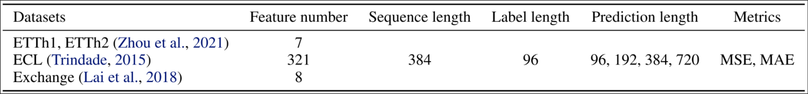
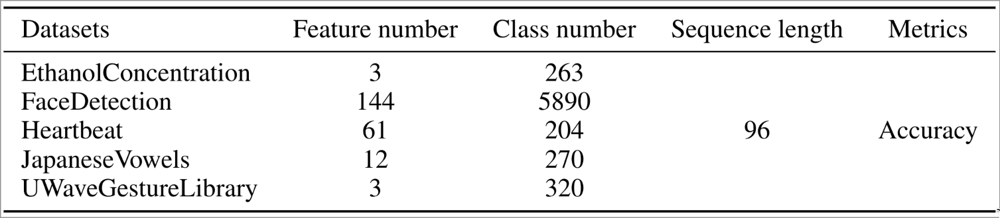
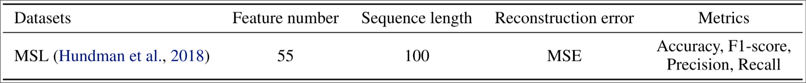

# :star2: UnitNorm


UnitNorm is a novel normalization technique to address challenges such as token shift, attention shift, and sparse attention faced by existing normalization (e.g., LayerNorm and BatchNorm) in Transformers.

All the code to reproduce the results in the paper is available in this repository, including all **6 models** and **9 datasets** used in **long-term forecasting**, **classification** and **anomaly detection** tasks.

## :rocket: Usage

### :package: Dependencies

- Python is required to run the code. We recommend using Python 3.11.6 (as we used in our experiments). Later versions should also work as long as the dependencies are compatible.
- Install the required packages using the following command (requires CUDA 12.1 or above):
  ```bash
  pip3 install -r requirements.txt
  ```
- (Optional) If you have a different version of CUDA or are using CPU only, you need to install the corresponding version of PyTorch according to the [official website](https://pytorch.org/get-started/locally/).

### :open_file_folder: Getting Data

- The datasets are preprocessed, and you can get them from [Google Drive](https://drive.google.com/file/d/1Ijq5EzJMkkenspaeu6r_3pYX2ElydY85). After downloading, extract the file to directory `dataset/` (create it if needed). The directory should look like this:
  ```sh
  .
  ├── data_provider/
  ├── dataset/
  │   ├── electricity/
  │   ├── EthanolConcentration/
  │   ├── ETT-small/
  │   ├── exchange_rate/
  │   ├── FaceDetection/
  │   ├── Heartbeat/
  │   ├── JapaneseVowels/
  │   ├── MSL/
  │   └── UWaveGestureLibrary/
  ├── exp/
  ├── layers/
  ├── models/
  ├── scripts/
  ├── utils/
  ├── LICENSE
  ├── README.md
  ├── requirements.txt
  └── run.py
  ```
- Here is a brief description of the datasets:
  
  
  

### :test_tube: Running Experiments

- To run the experiments, you can use the provided scripts in the `scripts/` directory. For example, to run the Crossformer model on the electricity dataset for forecasting with UnitNorm, you can use the following command:
  ```bash
  bash scripts/unitp/long_term_forecast/ECL_script/Crossformer.sh
  ```
- (Optional) The scripts are designed to run on 4 GPUs, if you have only 1 GPU, you can modify the script to use only one. For example, to run on GPU 0, you can use the following command to modify all the scripts at once:
  ```bash
  sed -i 's/CUDA_VISIBLE_DEVICES=0,1,2,3/CUDA_VISIBLE_DEVICES=0/g' scripts/**/*.sh
  sed -i 's/--use_multi_gpu/---gpu 0/g' scripts/**/*.sh
  ```
  You can also modify the scripts to use CPU only by setting the `--use_gpu` flag to false:
  ```bash
  sed -i 's/--use_multi_gpu/---use_gpu false/g' scripts/**/*.sh
  sed -i 's/--gpu 0/---use_gpu false/g' scripts/**/*.sh
  ```

## :scroll: Citation

This research is currently under review. Details for citation will be provided upon publication.

## :pray: Acknowledgement

This codebase is constructed based on the repo: [Time-Series-Library](https://github.com/thuml/Time-Series-Library)

All the experiment datasets are public, and we obtain them from the following links:

- [Long-term Forecasting](https://github.com/thuml/Autoformer)

- [Classification](https://www.timeseriesclassification.com/)

- [Anomaly Detection](https://github.com/thuml/Anomaly-Transformer)
